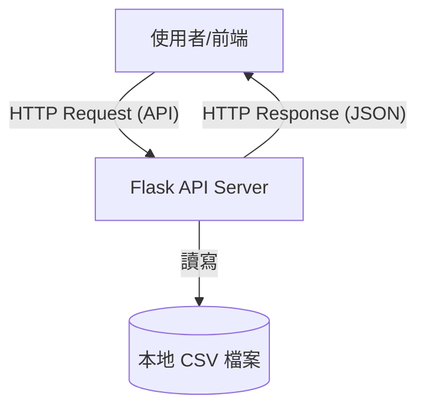
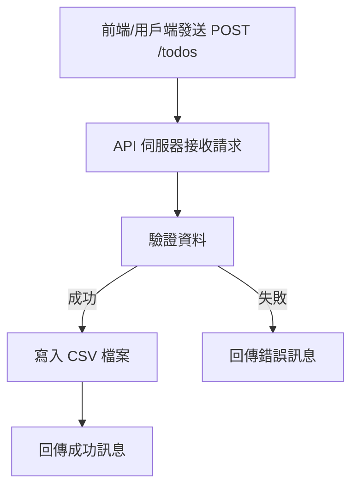
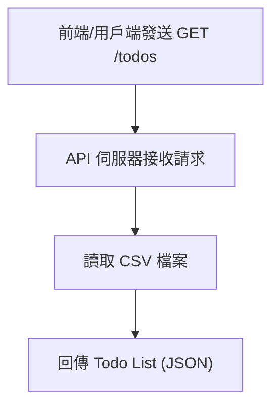
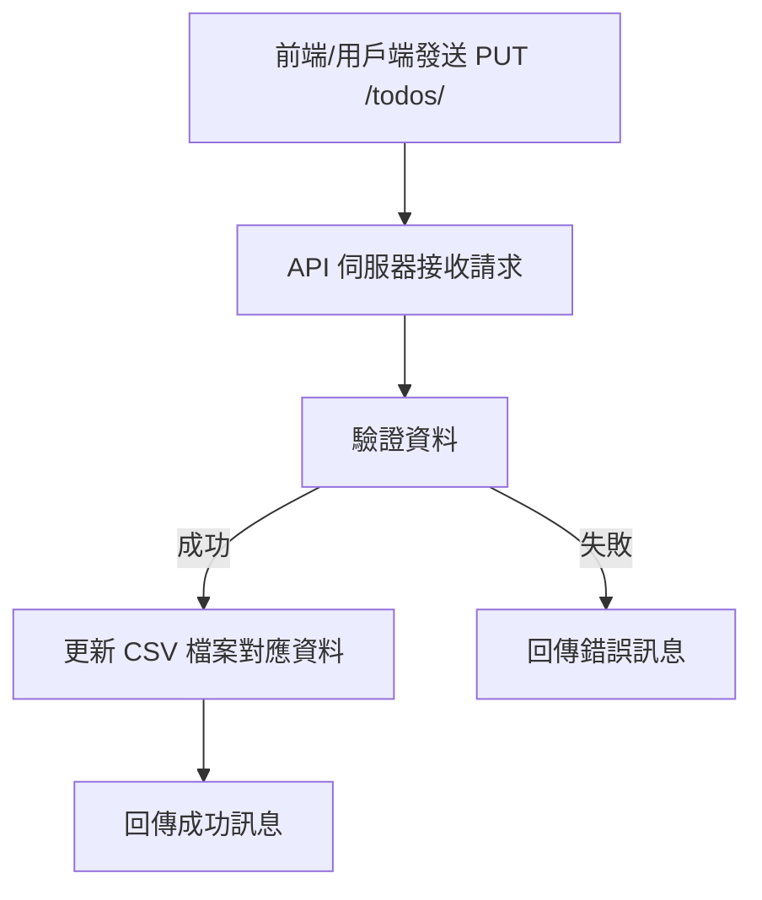
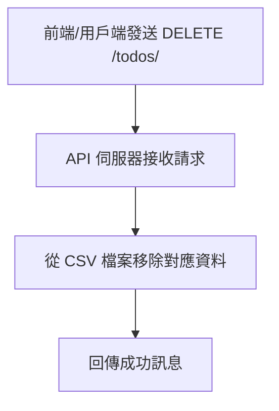

# Todo List Web 應用系統文件

## 系統簡介
本系統為一個以 Python 開發的簡易 Todo List Web 應用，資料儲存於本地 CSV 檔案。所有新增、查詢、更新、刪除（CRUD）功能皆以 RESTful API 方式提供，方便日後部署至雲端並以 Web 介面或 API 調用。

## API 呼叫方式與範例

### 1. 查詢所有 Todo

- **方法**：GET
- **URL**：`http://<server>:<port>/todos`
- **範例（curl）**：
	```bash
	curl -X GET http://localhost:5000/todos
	```
- **回應範例**：
	```json
	[
	  {"id": 1, "title": "讀英文第三課", "completed": false},
	  {"id": 2, "title": "寫自然課報告", "completed": true}
	]
	```

### 2. 新增 Todo

- **方法**：POST
- **URL**：`http://<server>:<port>/todos`
- **Headers**：`Content-Type: application/json`
- **Body 範例**：
	```json
	{"title": "學習 Python", "completed": false}
	```
- **範例（curl）**：
	```bash
	curl -X POST http://localhost:5000/todos \
	  -H "Content-Type: application/json" \
	  -d '{"title": "學習 Python", "completed": false}'
	```
- **回應範例**：
	```json
	{"id": 3, "title": "學習 Python", "completed": false}
	```

### 3. 更新 Todo

- **方法**：PUT
- **URL**：`http://<server>:<port>/todos/<id>`
- **Headers**：`Content-Type: application/json`
- **Body 範例**：
	```json
	{"title": "學習 Python (進階)", "completed": true}
	```
- **範例（curl）**：
	```bash
	curl -X PUT http://localhost:5000/todos/3 \
	  -H "Content-Type: application/json" \
	  -d '{"title": "學習 Python (進階)", "completed": true}'
	```
- **回應範例**：
	```json
	{"id": 3, "title": "學習 Python (進階)", "completed": true}
	```

### 4. 刪除 Todo

- **方法**：DELETE
- **URL**：`http://<server>:<port>/todos/<id>`
- **範例（curl）**：
	```bash
	curl -X DELETE http://localhost:5000/todos/3
	```
- **回應範例**：
	```json
	{"result": "success"}
	```

## 架構圖



## 功能流程圖


### 1. 新增 Todo




### 2. 查詢 Todo




### 3. 更新 Todo




### 4. 刪除 Todo



## API 規格

- `GET /todos`：查詢所有 Todo
- `POST /todos`：新增 Todo
- `PUT /todos/<id>`：更新指定 Todo
- `DELETE /todos/<id>`：刪除指定 Todo

## 部署建議

- 可直接於本地或雲端（如 AWS EC2、Azure VM）運行
- 部署時僅需確保 Python 環境與 Flask 套件安裝完成
- CSV 檔案可放置於伺服器本地，或改為雲端儲存服務
